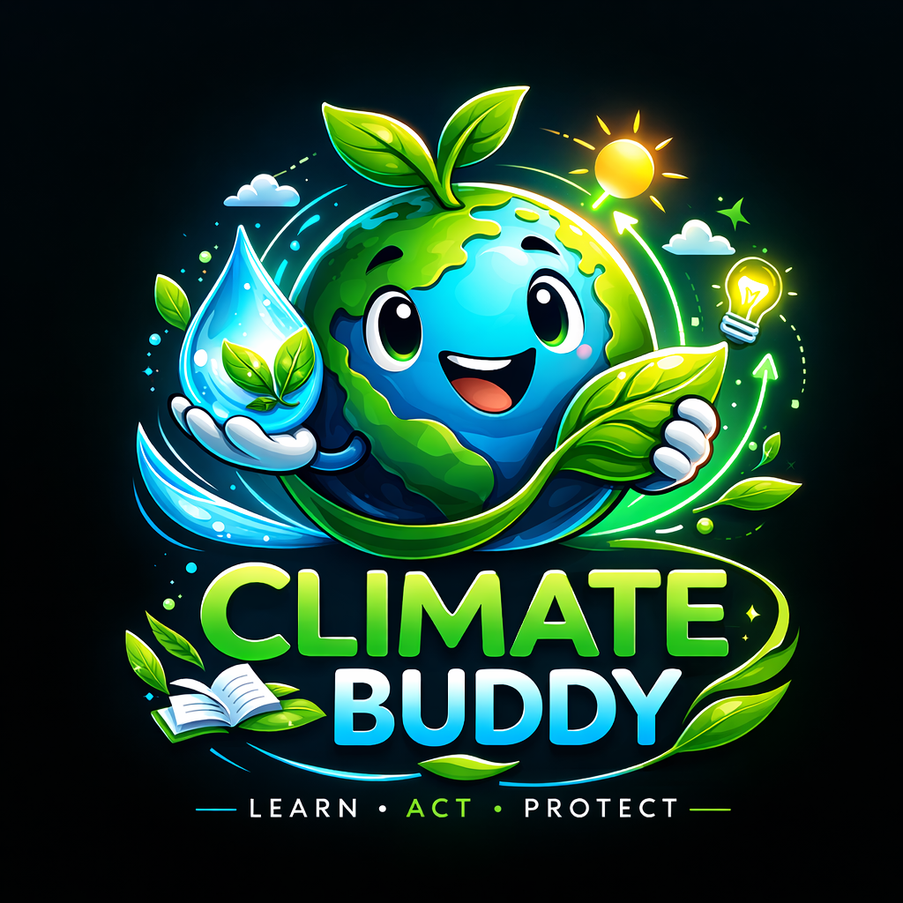

# 🌍 Climate Buddy

  

Climate Buddy is a sustainability micro-learning and habit-building app that helps people develop daily environmental actions.The application designed to encourage sustainable behaviour through daily climate facts, quizzes, and conservation challenges.
The app focuses on **water security, environmental conservation, and plastic pollution.

The app includes:

• Daily climate facts
• Kids mode and young adult mode 
• Climate challenges  
• Interactive quizzes  
• Water impact calculator  
• South African climate insights  
• Leaderboard and eco-streaks

Built with Python using Streamlit.
---

## 💡 Purpose

This project demonstrates how simple digital tools can support **environmental education and climate awareness**.

It was built as part of a portfolio exploring the intersection of:

Environmental Science  
Data and analytics  
Climate technology

---

## 🛠 Technologies Used

Python  
Google Colab  
IPyWidgets

---

## ▶ Run the App

1. Open the notebook
2. Click **Open in Colab**
3. Run all cells to launch Climate Buddy

---

## 📂 Project Files

climate_buddy_mvp.ipynb – main application notebook  
requirements.txt – required Python packages

---

## 🌱 Future Improvements

• Convert to a Streamlit web application  
• Add real environmental datasets  
• Track user progress across sessions  
• Expand quizzes and conservation challenges  
• Add mobile-friendly interface

---

## 👤 Author

Nobukhosi Malinga  
MSc Environmental Science – University of the Witwatersrand

## © License
This project is the intellectual property of Nobukhosi Malinga.  
Unauthorized commercial use or reproduction is not permitted.
GitHub:  
https://github.com/malinganobukhosifortunate-prog
